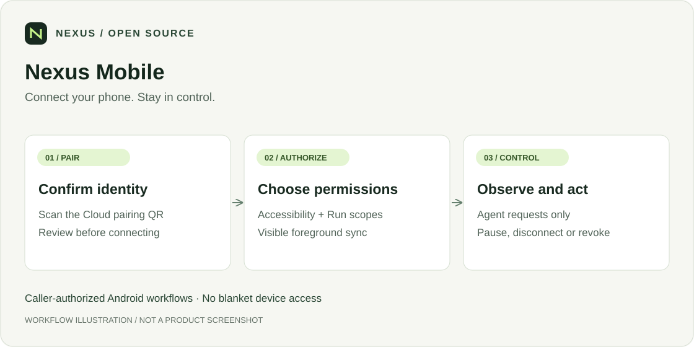

<div align="center">

# Nexus Mobile

**Connect your phone. Stay in control.**

[](LICENSE)
[](https://cloud.nexilume.com/)
[](README_GUIDE.md)
[](#引用)
[](https://github.com/Nexilume-AI/nexus-mobile/actions/workflows/ci.yml)

`Android` · `Explicit pairing` · `Scoped access`

[English](README.md) · **简体中文**

[功能](#可以做什么) · [快速开始](#快速开始) · [项目生态](#项目生态) · [参与贡献](#参与贡献) · [引用](#引用)

</div>

> **[在线体验 Nexus Cloud](https://cloud.nexilume.com/)**：在浏览器中探索 Nexus Cloud，也可以自行部署，开始使用。

面向已授权 Agent 工作流的 Android 伴侣应用：显式配对、按需授权，保持同步状态可见。



*这是流程示意图，不是产品截图。实际连接需要完成下文的安装、配置与授权。*

## 可以做什么

- 扫描一次性配对二维码，确认 Cloud 和设备身份。
- 显式开启 Accessibility，并在 Cloud 批准每个 Run 所需 scopes。
- 让支持的 Agent 观察和操作授权手机。
- 保持可见前台同步通知，随时暂停同步、断开或撤销。

## 下载 Android Beta

[下载 Nexus Mobile 0.1.2-beta.2 APK](https://github.com/Nexilume-AI/nexus-mobile/releases/download/v0.1.2-beta.2/nexus-mobile-0.1.2-beta.2.apk) · [发布说明与校验值](https://github.com/Nexilume-AI/nexus-mobile/releases/tag/v0.1.2-beta.2)

签名版 **0.1.2-beta.2** 修复屏幕共享授权后的 WebRTC 原生初始化闪退，达到 Android 后台同步时限时安全暂停，并为“无障碍已授权但控制服务未连接”提供准确的恢复引导。恢复过程保留配对。实时画面需要兼容的 Cloud/Web，跨 NAT 可能需要 TURN。开启无障碍权限前请阅读发布说明。

本版为自愿试用的 **Beta**，不代表通过生产或全部机型认证。真机端到端验收仍待完成，已验证的升级范围见发布说明。已安装的 Debug 版本使用不同签名，不能直接覆盖安装；如需迁移，请先保存需要的数据，再自行决定卸载 Debug 版本。

## 快速开始

需要 Android 8.0+、兼容 Nexus Cloud、摄像头及扫码时的相机权限；单次截图要求 Android 11+。不是 iOS 客户端，真实无 Google 服务设备的验收仍待完成。

使用 JDK 17 与 Android SDK platform 36：

```sh
sh gradlew testDebugUnitTest lintRelease assembleRelease --no-daemon
```

Windows 使用 `./gradlew.bat` 和相同参数。签名及验证见[发布指南](RELEASE.md)。

> [!IMPORTANT]
> `app-release-unsigned.apk` 不是可安装的正式发行包。Debug APK 仅用于受控开发。完整构建步骤与工具链注意事项见[参考](README_GUIDE.md#build-from-source)。

## 配对到首次操作

1. 在 Nexus Console 创建 Mobile，显示短期 pairing QR。
2. 点击 **扫描配对二维码 → 允许相机**，检查 Cloud/设备身份后选择 **配对并连接**。相机画面只在手机本地处理。
3. 跟随高亮的 **权限** 步骤；**启用设备控制** 先说明设置路径，再由你开启 **Nexus Mobile Control**。如被 Android 阻止，可打开应用内的限制设置引导。
4. 通知建议开启，但可跳过。权限在首页默认显示；**稍后** 只收起引导，不隐藏状态。检查连接状态及 Console，确认设备在线。
5. Attach 到 Agent Run，仅批准该任务需要的权限。

成功标准是：设备在线，且已授权的任务动作返回结果；不是只看到配对成功。

首页保留配对/连接和 **权限**，连接详情、隐私及移除配对位于 **⋮** 菜单。仅打开系统设置不会被视为授权，通知申请也必须由你主动点击。

## 隐私与文档

同步前使用测试应用和合成数据。输入敏感信息前暂停同步；脱敏检测并非绝对保证，截图不得绕过系统安全界面。撤销无法回滚已经执行的动作。

| 目标 | 入口 |
| --- | --- |
| 构建、安装与故障排查 | [完整参考](README_GUIDE.md) |
| 签名发行 | [Release](RELEASE.md) |
| 数据处理 | [Privacy](PRIVACY.md) |
| 平台限制 | [Constraints](docs/CONSTRAINTS.md) |
| 真实设备验收 | [Device acceptance](docs/DEVICE_ACCEPTANCE.md) |

## 项目生态

| 项目 | 职责 |
| --- | --- |
| [Nexus Cloud](https://github.com/Nexilume-AI/nexus-cloud-community) | Server、Web Console 与配套 Cloud Relay |
| [Python SDK](https://github.com/Nexilume-AI/nexus-agent-sdk-python) | Agent 应用与主动出站的 Computer Runtime |
| [OpenWrt](https://github.com/Nexilume-AI/nexus-openwrt) | 边缘注册、发现与能力路由 |
| [Mobile](https://github.com/Nexilume-AI/nexus-mobile) | 已授权的 Android 设备接入 |
| [Documentation](https://github.com/Nexilume-AI/nexus-docs) | 中英文教程与参考 |

设备组件独立安装与发布；是否可安装取决于仓库访问、发行包及版本兼容性。Cloud 启动不会自动安装它们。

## 参与贡献

请先阅读 [CONTRIBUTING.md](CONTRIBUTING.md)。欢迎修复问题、改进教程和补充翻译。

问题反馈请附组件版本与脱敏复现步骤，不要上传凭据、个人文件或真实设备配置。安全问题遵循 [SECURITY.md](SECURITY.md)。 CI 通过不等于所有平台均已完成生产验收。

## 引用

如果 Nexus 对你的研究或工程工作有帮助，请引用以下技术报告，而不是软件仓库。[CITATION.cff](CITATION.cff) 的 `preferred-citation` 提供同一报告的机器可读元数据。

Nexilume Research. *Nexus: An Execution Fabric for AI Agents Across Cloud, Edge, and Devices*. 技术报告 NX-SYS-2026-001，2026 年 9 月。

```bibtex
@techreport{nexilume2026nexus,
  author      = {{Nexilume Research}},
  title       = {{Nexus}: An Execution Fabric for {AI} Agents Across Cloud, Edge, and Devices},
  institution = {Nexilume Research},
  type        = {Technical Report},
  number      = {NX-SYS-2026-001},
  year        = {2026},
  month       = sep
}
```

## 许可证

Nexus 自有代码采用 [Apache License 2.0 (modified)](LICENSE)。第三方组件保留各自许可证与声明；公开文档不授予独立企业版实现的使用权。

### 许可条件

Nexus 采用 Apache License 2.0 的修改版，并附加以下条件。多租户服务运营及移除现有 Nexus 界面品牌标识须事先取得书面授权。此前的 Apache-2.0 授权和第三方许可证保持不变。贡献者须明确同意允许商业使用及未来重新许可的贡献协议。许可说明：[LICENSING.md](LICENSING.md)。授权联系：**cary.nexilume@outlook.com**。
